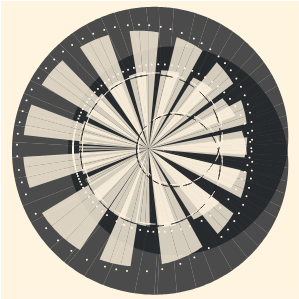

Welcome to my portfolio site! Here I show off a handful of the personal front-end and iOS projects I've been working on.

## Front-end

### Roulette

[Roulette](https://h-n-y.github.io/roulette) is an art tool I made with **React** for creating [Spirograph](https://en.wikipedia.org/wiki/Spirograph)-like designs. Similar to a Spirograph, Roulette works by rotating a wheel, fixed with a pen, around the surface of another wheel. In so doing, the pen traces out shapes with stroke or fill patterns.

Here are some examples of what Roulette can do:

### Trick-or-Treat

While taking [a course with Udacity](https://www.udacity.com/course/front-end-web-developer-nanodegree--nd001) to solidfy my front-end skillset, I created [this JavaScript game](https://h-n-y.github.io/trick-or-treat). Udacity provided me a simple game engine that continuously rerenders the board and several image assets. The game-specific design, code, and assets, however, are my own creation.

### Melody

[Melody](https://h-n-y.github.io/melody) is a straightforward responsive music search app created with **Angular 6**. All search results are requested from a 3rd-party API provided my [musixmatch](https://developer.musixmatch.com).

## iOS

### OXO

OXO is a native tic-tac-toe app for iPhone. Most notable to me about this app is the in-memory game tree I created using a modified [minimax algorithm](https://en.wikipedia.org/wiki/Minimax). The game tree provides the "computer" opponent full knowledge of the state of the game. By adjusting the probability of the computer's moving to a suboptimal branch of the tree, I could adjust its difficulty from "easy" to "impossible-to-beat".

See [this release trailer](https://www.youtube.com/watch?v=bjkJCgwsfvU) I made for the game with iMovie.
